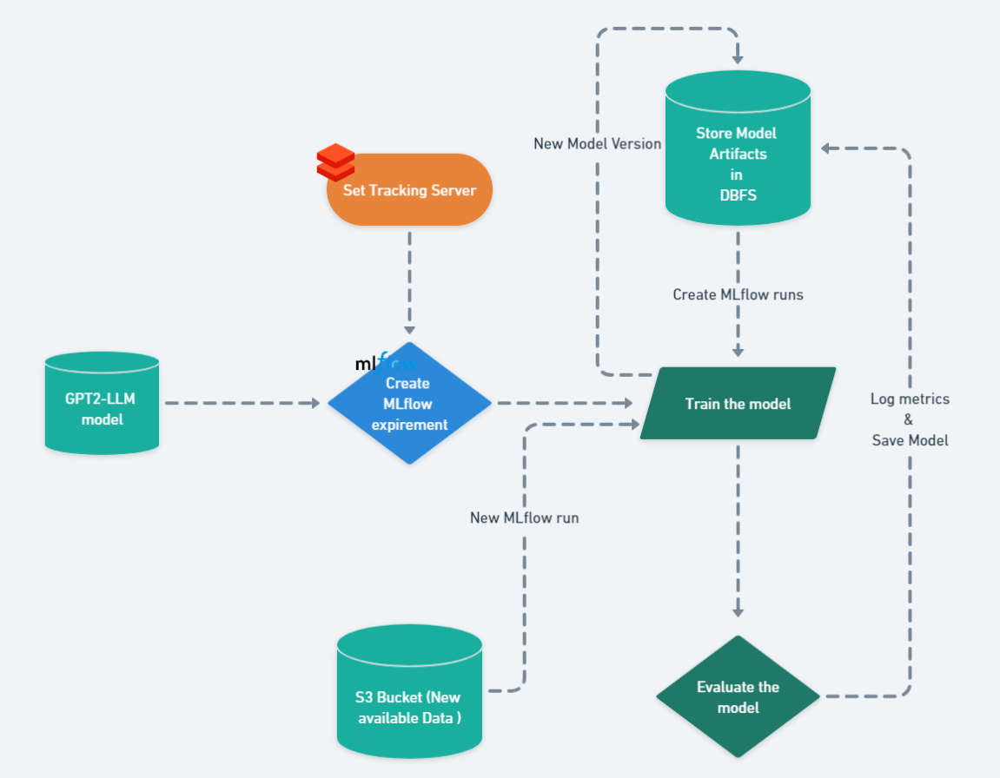

# GPT2 - Large LANGUAGE MODEL (GPTArticles-Assistant)

[](https://mlflow.org/)
[](https://www.python.org/)

## Overview

MLflow simplifies the machine learning lifecycle from data extraction to model deployment. It starts with data extraction and MLflow run initialization, where models are fine-tuned. MLflow tracks and logs parameters, metrics, and artifacts, ensuring reproducibility and traceability. Experiments are organized, making it easy to manage and compare results. Successful models are deployed for production use. MLflow supports continuous improvement, keeping models up-to-date and adaptable. It streamlines deployment, making models accessible through REST APIs or other methods. MLflow enhances end-to-end machine learning management

## Table of Contents

- [Getting Started](#getting-started)
  - [Prerequisites](#prerequisites)
  - [Installation](#installation)
- [Overview of the Large Language Model](#overView-of-the-Model)
- [Set Up the environment](#usage)
- [MLflow Architecture](#MLflow-Architecture)
- [Inference](#inference)
- [Model Tracking](#model-tracking)
- [Contributing](#contributing)
- [License](#license)

## Getting Started

### Prerequisites

- **GPUs (Graphics Processing Units):** This project may involve intensive machine learning tasks that benefit from GPU acceleration. Ensure access to GPUs or a GPU-enabled environment for faster model training and inference.

- **PyTorch:** PyTorch is a deep learning framework used in this project. Install PyTorch to leverage its powerful capabilities for model development and training.

- **Transformers Library:** The Transformers library provides pre-trained models and tools for natural language processing tasks. Install this library to work with state-of-the-art models like GPT-2.

- **AWS IAM Role:** If you plan to interact with AWS services, such as S3 for data storage, ensure you have an AWS Identity and Access Management (IAM) role set up with the necessary permissions for secure access.

- **S3 Bucket:** Create an Amazon S3 (Simple Storage Service) bucket to store data, models, and artifacts. Configure access and permissions accordingly to work seamlessly with your AWS IAM role.

```bash
pip install -r requirements.txt
```

## Overview of the Large Language Model

**GPT-2 (Generative Pre-trained Transformer 2)** is a state-of-the-art language model developed by OpenAI. It's renowned for its large-scale architecture, pre-trained on a vast dataset from the internet. GPT-2 excels in generating coherent and contextually relevant text given a prompt. This versatility extends to various natural language processing tasks, including text completion, summarization, translation, and more.

GPT-2's remarkable performance and open-source availability have made it a cornerstone in the field of natural language processing. However, its use has also raised ethical concerns due to its potential to generate highly convincing fake text, emphasizing the importance of responsible AI deployment. Despite these concerns, GPT-2 remains a pivotal tool for researchers and developers in a wide range of applications.

<div align="center">
  
</div>

## Set Up the environment

- **Setting DataBricks Connection nad Configure MLflow space:** 
Aftre Creating your Databricks MLflow space follow the following steps : 

```bash 
databricks configure --host https://community.cloud.databricks.com/
```

then Connect to your MLflow Experiment using the following code : 

```python 
import mlflow

mlflow.set_tracking_uri("databricks")
mlflow.set_experiment("/Users/<user-name>/<space-name>")
```
**Connecting to your AWS S3 Bucket : **
First make sure you have an IAM role access so you can connect to your s3 bucket and perform many operations:

```python 
import boto3

AWS_ACCESS_KEY_ID = "<your-aws-access-key-id>"
AWS_SECRET_ACCESS_KEY = "<your-aws-secret-access-key>"
S3_BUCKET_NAME = '<your-s3-bucket-name>'

def s3_client():
    return boto3.client('s3', aws_access_key_id=AWS_ACCESS_KEY_ID, aws_secret_access_key=AWS_SECRET_ACCESS_KEY)

def test_s3_bucket_exists(s3_client):
    # Check if the S3 bucket exists
    try:
        s3_client.head_bucket(Bucket=S3_BUCKET_NAME)
        print(f"S3 Bucket '{S3_BUCKET_NAME}' exists.")
    except Exception as e:
        print(f"Error: {e}")
        print(f"S3 Bucket '{S3_BUCKET_NAME}' does not exist.")

def test_s3_bucket_access(s3_client):
    # Check if you can list objects in the S3 bucket
    try:
        response = s3_client.list_objects_v2(Bucket=S3_BUCKET_NAME)
        if 'Contents' in response:
            print(f"Successfully accessed objects in S3 Bucket '{S3_BUCKET_NAME}'.")
        else:
            print(f"No objects found in S3 Bucket '{S3_BUCKET_NAME}'.")
    except Exception as e:
        print(f"Error: {e}")
```

For getting all your S3 files's detailes , use the following code : 
```python 
def list_files_in_bucket(s3_client, bucket_name):
    file_info_list = []

    try:
        response = s3_client.list_objects_v2(Bucket=bucket_name)
        if 'Contents' in response:
            for obj in response['Contents']:
                file_info = {
                    'File': obj['Key'],
                    'Size (bytes)': obj['Size'],
                    'Last Modified': obj['LastModified'],
                    # Add more fields as needed
                }
                file_info_list.append(file_info)
        else:
            print(f"No objects found in S3 Bucket '{bucket_name}'.")
    except Exception as e:
        print(f"Error: {e}")

    return file_info_list

```

## MLflow Architecture 

# MLflow Project Architecture

<div align="center">
  
</div>


## Overview

The MLflow project architecture is designed to streamline the process of developing, fine-tuning, and deploying machine learning models. It offers a structured approach to experiment tracking, model versioning, and continuous learning.

## Key Components

### 1. Setting Up Tracking Server in Databricks

The MLflow project begins by configuring a tracking server in Databricks. This server serves as a centralized hub for managing and tracking machine learning experiments and models.

### 2. Creating MLflow Experiments

Within the tracking server, MLflow experiments are created. Each experiment represents a specific machine learning task or project. It provides an organized container for runs related to that task.

### 3. Model Fine-Tuning Runs

For each machine learning model requiring fine-tuning, MLflow initiates individual runs within the corresponding experiment. These runs are iterations or versions of the model, each with different hyperparameters or training data.

```python 
from transformers import GPT2LMHeadModel, GPT2Tokenizer, TextDataset, DataCollatorForLanguageModeling, TrainingArguments, Trainer
import mlflow


def fine_tune_gpt2_with_mlflow(model_name, train_file, experiment_id):
    # Start a new MLflow run
    with mlflow.start_run() as run:

        # Set the experiment ID


        # Log the parameters
        mlflow.log_param("model_name", model_name)
        mlflow.log_param("train_file", train_file)

        # Load GPT-2 model and tokenizer
        model = GPT2LMHeadModel.from_pretrained(model_name)
        tokenizer = GPT2Tokenizer.from_pretrained(model_name)

        # Load training dataset
        train_dataset = TextDataset(
            tokenizer=tokenizer,
            file_path=train_file,
            block_size=128)

        # Create data collator for language modeling
        data_collator = DataCollatorForLanguageModeling(
            tokenizer=tokenizer, mlm=False)

        # Set training arguments
        training_args = TrainingArguments(
            output_dir=mlflow.get_artifact_uri("output_model"),
            overwrite_output_dir=True,
            num_train_epochs=10,
            per_device_train_batch_size=4,
            save_steps=10_000,
            save_total_limit=10,
        )

        # Train the model
        trainer = Trainer(
            model=model,
            args=training_args,
            data_collator=data_collator,
            train_dataset=train_dataset,
        )
        training_output = trainer.train()

        # Save the fine-tuned model and tokenizer
        model.save_pretrained(training_args.output_dir)
        tokenizer.save_pretrained(training_args.output_dir)

        # Log training metrics
        mlflow.log_metrics(training_output.metrics)

        # Log the model and tokenizer as artifacts in Databricks DBFS
        mlflow.log_artifacts(training_args.output_dir, artifact_path="model_and_tokenizer")

        # Register the model and tokenizer as a single entity
        mlflow.pytorch.log_model(trainer.model, "fine_tuned_gpt2")

```

### 4. Model Evaluation

After fine-tuning, models are rigorously evaluated using various metrics to assess their performance. MLflow enables comprehensive evaluation, aiding data scientists in model selection and improvement.

### 5. Storage of Models and Artifacts

MLflow stores trained models and their associated artifacts in Databricks File System (DBFS). This ensures easy access to models and relevant files and provides versioning for future reference.

```python
model.save_pretrained(training_args.output_dir)
tokenizer.save_pretrained(training_args.output_dir)

# Log training metrics
mlflow.log_metrics(training_output.metrics)

# Log the model and tokenizer as artifacts in Databricks DBFS
mlflow.log_artifacts(training_args.output_dir, artifact_path="model_and_tokenizer")

# Register the model and tokenizer as a single entity
mlflow.pytorch.log_model(trainer.model, "fine_tuned_gpt2")
```
### 6. Continuous Learning

MLflow's architecture supports continuous learning. When new data becomes available in the S3 bucket, the process can be repeated. New model versions are trained on fresh data, enhancing their capabilities and adapting to changing conditions.

## Conclusion

The MLflow project architecture facilitates structured machine learning project management, ensuring reproducibility, scalability, and adaptation to evolving data.

For more detailed information on each component, please refer to the respective documentation.


