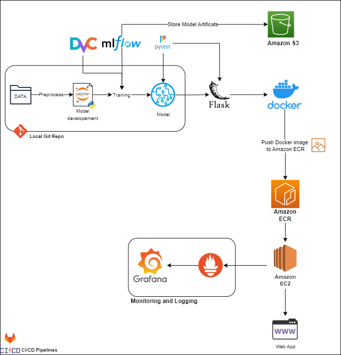

<!-- Logo, Title, and Badges Section -->
<p align="center">
  <a>
    
  </a>
</p>

<h1 align="center">End-to-End MLOps: From Data to Deployment</h1>

<p align="center">
  <a href="https://www.python.org/">
    
  </a>
  <a href="https://github.com/your-username/your-repo">
    
  </a>
  <a href="https://www.docker.com/">
    
  </a>
  <a href="https://www.tensorflow.org/">
    
  </a>
  <a href="https://jupyter.org/">
    
  </a>
</p>

<p align="center">
  
  
  
  <a href="https://cdnlogo.com/logo/data-version-control_134778.html">
    
  </a>
  <a title="Jason Long, CC BY 3.0 <https://creativecommons.org/licenses/by/3.0>, via Wikimedia Commons" href="https://commons.wikimedia.org/wiki/File:Git-logo.svg">
    
  </a>
<a title="Amazon.com, Inc., Public domain, via Wikimedia Commons" href="https://commons.wikimedia.org/wiki/File:Amazon-S3-Logo.svg"></a>  
  
</p>

<!-- Divider -->
<hr>

## Introduction
Welcome to the MLOps project! This repository aims to showcase a comprehensive MLOps implementation, enabling smooth and efficient development, deployment, and maintenance of machine learning models. MLOps is the practice of integrating machine learning workflows with DevOps practices, ensuring reproducibility, scalability, and automation throughout the model's lifecycle.

## Project Overview
The MLOps project provides a structured and organized pipeline for machine learning projects, covering the entire workflow from data preprocessing to model deployment. The primary goal is to streamline collaboration among data scientists, machine learning engineers, and operations teams, leading to a more efficient and reliable model deployment process.

## 🚀 Features
- Data versioning and management using DVC 📊
- Unit testing and integration testing with pytest 🧪
- Model serving and API creation with Flask 🤖
- Containerization and deployment with Docker 🐳
- Cloud infrastructure and deployment on Amazon EC2 ☁️
- Monitoring and visualization with Grafana 📈
- Version control and continuous integration with GitLab 🔧

## Tech Stack
The MLOps project utilizes the following main tools and libraries:

- TensorFlow 🧠 - an open-source machine learning library.
- Scikit-learn 📚 - a machine learning library for Python.
- MLflow 📦 - an open-source platform for the complete machine learning lifecycle.
- DVC 📈 - a version control system for data sets and machine learning models.
- Pytest 🧪 - a testing framework for Python.
- Flask 🤖 - a lightweight web framework for creating APIs.
- Docker 🐳 - containerization platform for packaging applications.
- Amazon EC2 ☁️ - cloud-based virtual machines for deployment.
- Grafana 📈 - a monitoring and observability platform.
- GitLab 🔧 - version control and continuous integration platform.

## Architecture

<p align="center">
  
</p>


## Getting Started
To get started with this project, follow these instructions to set up your environment and start working with the MLOps pipeline.

### Installation
```bash
# Clone the repository to your local machine
git clone https://github.com/your-username/mlops-project.git
cd mlops-project

# Create and activate a virtual environment (optional but recommended)
python -m venv venv
source venv/bin/activate   # For Windows, use: venv\Scripts\activate

# Install the required dependencies
pip install -r requirements.txt
```
### Project Structure
```bash
|-- mlops_project/
    |-- data/
    |-- models/
    |-- notebooks/
    |-- scripts/
    |-- tests/
    |-- config/
    |-- README.md
    |-- requirements.txt
    |-- .gitignore

```

